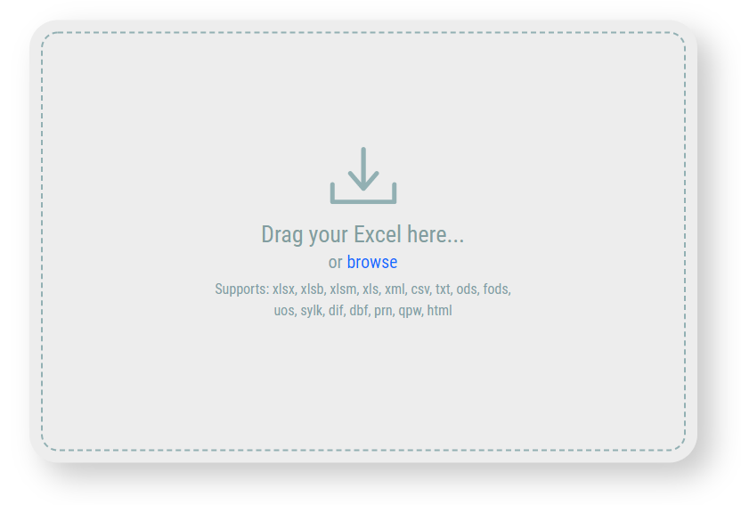
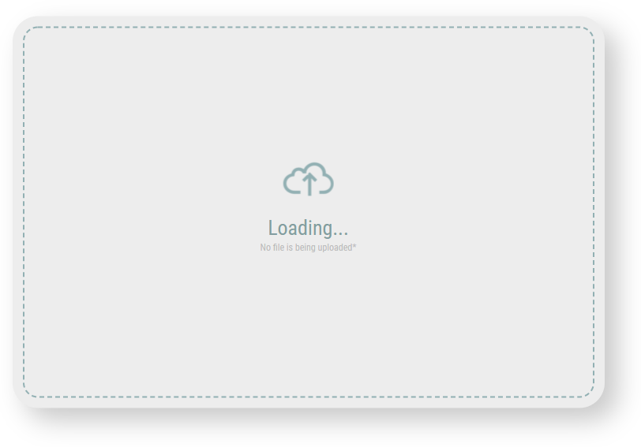
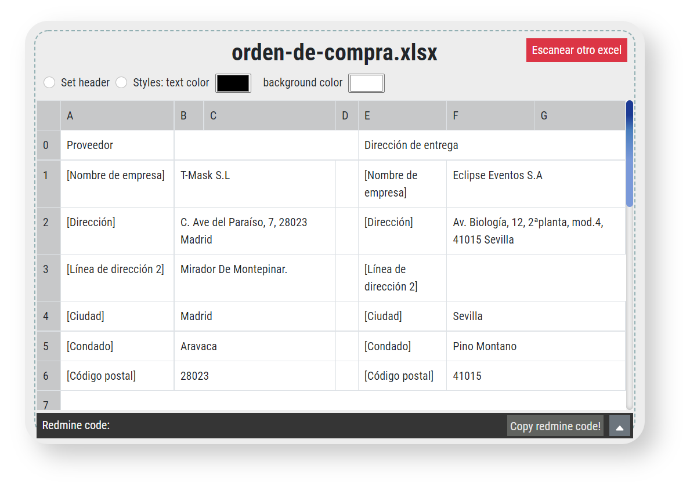
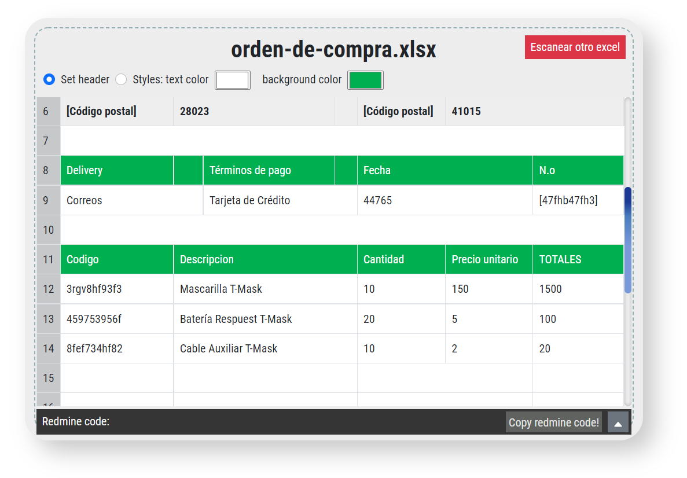

# Excel to Redmine
React app built to generate redmine tables through excel files. It let you to set header and add styles such as text/background color.

## How to use

Firstable, you can  either drag your excel file or click in the panel to browse it.  
Once you have done the first step, your file will be procesated and an image like this will appear with an uploading gif, nevertheless, no file is going to be uploaded. Your file is procesated solely in your computer:  

  

When it has loaded, your excel will be displayed as a HTML table. Unfortunately, cells format can't be read from an excel, so you'll have to set headers or text/background color. 
To set a cell as header, you have to click in the first radio button over the table. Otherwise, to change the text/background color, you have to click the second radio button and change the color inputs with the desired colors.

 

While you style your table, the redmine code is being updated as well, but it is hidden. To make it visible you have to click de button with the up arrow behind the table. To copy de code you only have to click the button "Copy redmine code", instead of coping it manually:  
  